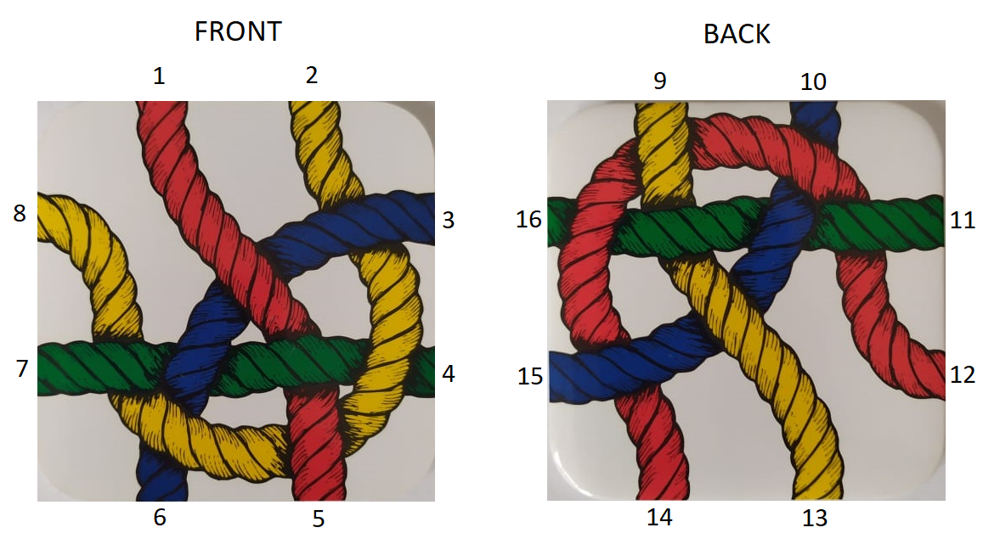
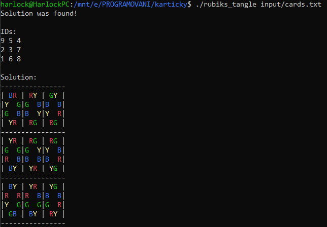

# Rubik's tangle
Rubik's tangle (3×3, double-sided) solver in C++.  

Rubik's tangle is an original logic puzzle with 9 double-sided tile pieces,  
whose task is to create a 3x3 area so that the ropes with same color connect each other.  
There is 95 126 813 710 possibilities, but only 1 is correct.

# How to run
You can put your cards in [input/cards.txt](input/cards.txt)(file format spec. below) and then simply:

```
make run
```

Or build application and specify file at startup:

```
make
```

```
./rubiks_tangle fileName
```

To clean build files use:

```
make clean
```

# File format
You can see example in [input/cards.txt](input/cards.txt).  
It is a textfile. Whitespaces, blank lines and newlines are skipped.  
File must contains exactly 9 cards, each card is in format:  

`
id C1 C2 C3 C4 C5 C6 C7 C8 C9 C10 C11 C12 C13 C14 C15 C16
`

* `id` is number between 1 and 9 to easily identify card in solution
* `Ci` is char representing color of rope on `i-th` position
  * allowed chars are `R`(red), `G`(green), `B`(blue), `Y`(yellow)
  * positions 1-8 are on frontside of card, positions 9-16 are on backside
  * positions are numbered clockwise(see picture below)  



# Solution
If solution was found, it prints ordered card IDs which represents solution.  
It also prints detailed solution with card's colored text representation using [ANSI escape codes.](https://www.lihaoyi.com/post/BuildyourownCommandLinewithANSIescapecodes.html)  

